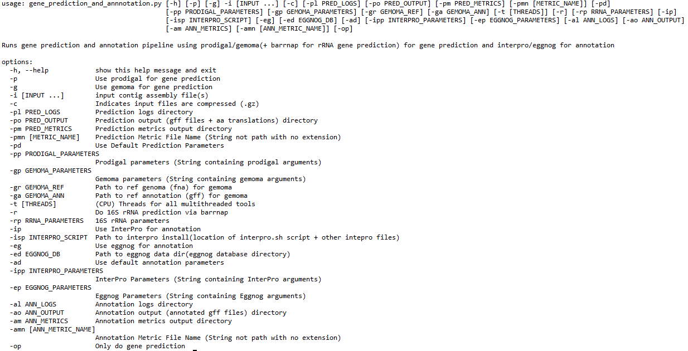

# Parameters
For a quick look at what parameters are available for the pipeline use:

```bash
./gene_annotation_and_prediction.py -h
```

This should provide the following as an output:



You will notice that the input only has one required parameter(input assemblies), this is due to the flexibility of the script offering many different modes. The script does check that at a minimum, you have chosen a prediction method, have input files, prediction parameters or default parameters are set, and if the only prediction flag is not set, that an annotation method and either the eggnog db or interpro script is given along with default or given annotation parameters.  

# List of Parameters
## -p
Flag to specify prodigal for gene prediction(Only one of -p or -g can be set)
## -g
Flag to specify gemoma for gene prediction(Only one of -p or -g can be set)
## -i
Input files (.gz compressed or uncompressed) given as a space separated list in the terminal(works with glob expansion)
## -c
Flag to specify that your input files are compressed(.gz)
## -pl
Optional parameter to specify prediction log directory (default is ./prediction_logs)
## -po
Optional parameter to specify prediction output directory (default is ./prediction_outputs)
## -pm
Optional parameter to specify prediction metric directory (default is ./prediction_metrics)
## -pmn
Optional parameter to specify file name(not path) of the prediction metric file (default is Prediction_Metrics.tsv and Prediction_Metrics_rRNA.tsv for barrnap)
## -pd
Flag to specify default prediction parameters
##-pp
If you are using prodigal for gene prediction, pp allows you to specify specific arguments for prodigal other than the input and outputs
## -gp
If you are using gemoma for gene prediction, gp allows you to specify specific arguments for gemoma other than the input and outputs
## -gr
Path to the reference genome for gemoma prediction
## -ga 
Path to the reference annotation for gemoma prediction
## -t
Number of cpu threads for parallelization(for those tools that offer it), default is 8
## -r
Flag to do rRNA gene prediction via barrnap
## -rp
If you are doing rRNA gene prediction, tp allows you to specify specific arguments for barrnap other than the input and outputs
## -ip
Flag to specify InterPro for gene annotation
## -isp
Path to the InterPro install(Path to interproscan.sh script)
## -eg
Flag to specify EggNOG for gene annotation
## -ed
Path to the eggnog database directory
## -ad
Flag to specify the use of default annotation parameters
## -ipp
If you are using InterPro for gene annotation, ipp allows you to specify specific arguments for InterPro other than the input and outputs
## -ep
If you are using EggNOG for gene annotation, ipp allows you to specify specific arguments for EggNOG other than the input and outputs
## -al
Optional parameter to specify annnotation log directory (default is ./annotation_logs)
## -ao
Optional parameter to specify annotation output directory (default is ./annotation_outputs)
## -am
Optional parameter to specify annotation metric directory (default is ./annotation_metrics)
## -amn
Optional parameter to specify file name(not path) of the annotation metric file (default is Annotation_Metrics.tsv)
## -op
Flag to specify only doing gene prediction and no gene annotation


